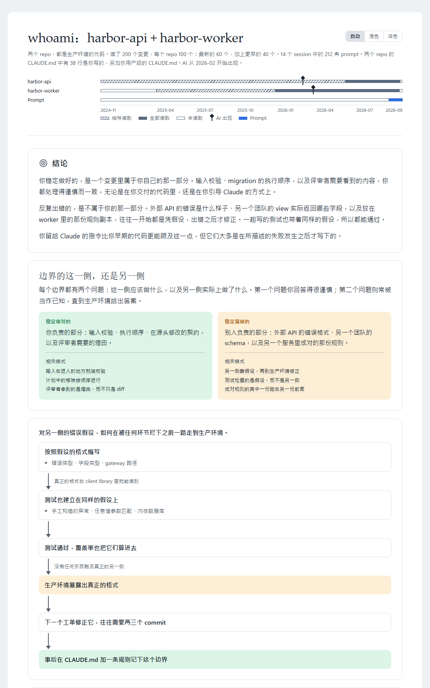

<!-- translated from README.md, source sha256 5d2e12f6ff28601b43624a519b159a27476b27268551c6c54de0227d5cf7b61e; see CLAUDE.md "Translations of the root README" before editing -->
# tundra

<div align="center">

[](#install) [](LICENSE)

[English](README.md) | [繁體中文](README.zh-TW.md) | [简体中文](README.zh-CN.md)

</div>

SoftwareOne Platform 的 Claude Code plugin marketplace。

<a id="install"></a>
## 📦 安装

```
/plugin marketplace add https://github.com/softwareone-platform/tundra.git
```

然后从中安装你需要的 plugin：

```
/plugin install <plugin>@tundra
```

之后运行 `/reload-plugins` 来启用它们。

对于这样的 marketplace，Claude Code 默认不开启自动更新，所以在你开启之前都不会收到新版本：`/plugin` → **Marketplaces** → `tundra` → **Enable auto-update**。

请使用上面完整的 HTTPS URL。`softwareone-platform/tundra` 这种简写也能用，但它通过 SSH clone，是不同的指令。

<a id="what-is-in-it"></a>
## 🗂️ 内容

除了 `whoami`，每个 skill 都会在你用自己的话描述任务时启动，也都可以用 `/<plugin>:<skill>` 直接运行。

### 🔁 从工单到 pull request

四个 plugin，把一个工单带到经过审查的 pull request。它们放在 [issue-to-pr](https://github.com/softwareone-platform/issue-to-pr/blob/main/README.zh-CN.md) 中，并且一起发布。`issue-to-pr-pipeline` 运行整个流程；在 Claude Code v2.1.143 或更高版本上，安装它就会一并安装另外三个，而那三个也都可以独立使用。

```
/plugin install issue-to-pr-pipeline@tundra
```

| Plugin | 做什么 | Skill |
|---|---|---|
| [`issue-to-pr-pipeline`](https://github.com/softwareone-platform/issue-to-pr/blob/main/README.zh-CN.md#issue-to-pr-pipeline) | 把一个工单从诊断带到经过审查的 pull request，批准计划前和创建 PR 前各停下来等你一次 | `resolve-issue`<br>`resolve-issue-dashboard`<br>`resolve-issue-learnings` |
| [`disconfirm-first`](https://github.com/softwareone-platform/issue-to-pr/blob/main/README.zh-CN.md#disconfirm-first) | 在下一步以它为基础之前，对 issue、计划或已实现的修复进行对抗式审查 | `review-issue-fact`<br>`review-plan-risk`<br>`review-code-risk` |
| [`test-authoring`](https://github.com/softwareone-platform/issue-to-pr/blob/main/README.zh-CN.md#test-authoring) | 找出测试缺口，编写单元测试和集成测试，每个测试都由独立的验证者检查 | `scan-test-gaps`<br>`add-unit-test`<br>`add-integration-test`<br>`update-unit-test`<br>`update-integration-test`<br>`setup-test-context` |
| [`pr-lifecycle`](https://github.com/softwareone-platform/issue-to-pr/blob/main/README.zh-CN.md#pr-lifecycle) | 在 Azure DevOps 或 GitHub 上按你以往 PR 的风格创建 pull request，并处理它的评审意见 | `open-pr`<br>`resolve-pr-comments` |


### 🪞 你的工作方式

| Plugin | 做什么 | Skill |
|---|---|---|
| [`whoami`](plugins/whoami/README.md) | 根据你的代码、你的 prompt 和你的 CLAUDE.md 做一份自我评估，输出为 HTML 报告 | `/whoami:whoami`，只有你能启动 |

它读取以你的名义交付的代码、你给 Claude 的 prompt，以及你的 `CLAUDE.md`，逐一检验每个反复出现的模式有没有其他原因能解释，再总结出哪一类问题你稳定做对、哪一类问题你稳定漏掉。它只读你指定的 repo，你的 prompt 和指令也只在你同意之后才会读。报告会用你要求的语言撰写。

<picture>
  <source media="(prefers-color-scheme: dark)" srcset="docs/whoami/report-overview-dark.zh-CN.png">
  
</picture>
