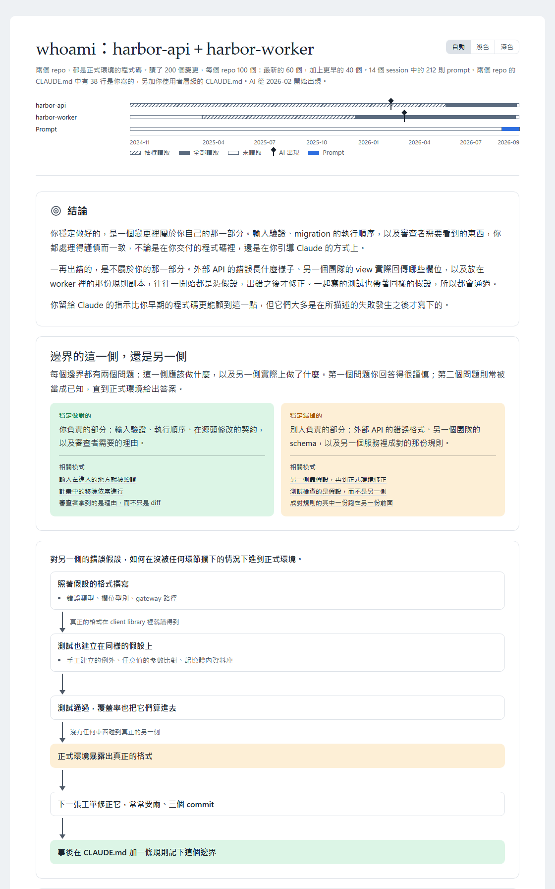

<!-- translated from README.md, source sha256 b503adff85d3fda176bc475e76aad822785ac609488e280c3414edacaec610aa; see CLAUDE.md "Translations of the root README" before editing -->
# tundra

<div align="center">

[](#install) [](LICENSE)

[English](README.md) | [繁體中文](README.zh-TW.md) | [简体中文](README.zh-CN.md)

</div>

SoftwareOne Platform 的 Claude Code plugin marketplace。

<a id="install"></a>
## 📦 安裝

```
/plugin marketplace add https://github.com/softwareone-platform/tundra.git
```

然後從中安裝你想要的 plugin：

```
/plugin install <plugin>@tundra
```

之後執行 `/reload-plugins` 來啟用它們。

像這樣的 marketplace，Claude Code 預設不開啟自動更新，所以在你開啟之前都不會收到新版本：`/plugin` → **Marketplaces** → `tundra` → **Enable auto-update**。

請使用上面完整的 HTTPS URL。`softwareone-platform/tundra` 這種簡寫也能用，但它透過 SSH clone，是不同的指令。

<a id="what-is-in-it"></a>
## 🗂️ 內容

除了 `whoami`，每個 skill 都會在你用自己的話描述任務時啟動，也都能用 `/<plugin>:<skill>` 直接執行。

### 🔁 從工單到 pull request

四個 plugin，把一張工單帶到經過審查的 pull request。它們放在 [issue-to-pr](https://github.com/softwareone-platform/issue-to-pr/blob/main/README.zh-TW.md)，並且一起發布。`issue-to-pr-pipeline` 執行整個流程；在 Claude Code v2.1.143 或更新的版本上，安裝它就會一併安裝另外三個，而那三個也都能獨立使用。

```
/plugin install issue-to-pr-pipeline@tundra
```

| Plugin | 做什麼 | Skill |
|---|---|---|
| [`issue-to-pr-pipeline`](https://github.com/softwareone-platform/issue-to-pr/blob/main/README.zh-TW.md#issue-to-pr-pipeline) | 把一張工單從診斷帶到經過審查的 pull request，核准計畫前和開出 PR 前各停下來等你一次 | `resolve-issue`<br>`resolve-issue-dashboard`<br>`resolve-issue-learnings` |
| [`disconfirm-first`](https://github.com/softwareone-platform/issue-to-pr/blob/main/README.zh-TW.md#disconfirm-first) | 在下一步以它為基礎之前，對 issue、計畫或已實作的修正做對抗式審查 | `review-issue-fact`<br>`review-plan-risk`<br>`review-code-risk` |
| [`test-authoring`](https://github.com/softwareone-platform/issue-to-pr/blob/main/README.zh-TW.md#test-authoring) | 找出測試缺口，撰寫單元測試與整合測試，每個測試都由獨立的驗證者檢查 | `scan-test-gaps`<br>`add-unit-test`<br>`add-integration-test`<br>`update-unit-test`<br>`update-integration-test`<br>`setup-test-context` |
| [`pr-lifecycle`](https://github.com/softwareone-platform/issue-to-pr/blob/main/README.zh-TW.md#pr-lifecycle) | 在 Azure DevOps 或 GitHub 上依你過去 PR 的風格開出 pull request，並處理它的審查意見 | `open-pr`<br>`resolve-pr-comments` |


### 🪞 你的工作方式

| Plugin | 做什麼 | Skill |
|---|---|---|
| [`whoami`](plugins/whoami/README.md) | 從你的程式碼、你的 prompt 和你的 CLAUDE.md 做一份自我評估，輸出成 HTML 報告 | `/whoami:whoami`，只有你能啟動 |
| [`remind-me`](plugins/remind-me/README.md) | 你在某一天跑過的 session 還留下哪些沒做完的事，逐一對照每個 pull request 和 branch 的即時狀態，並提供回到每個 session 的入口 | `remind-me` |

`whoami` 讀取以你的名義交付的程式碼、你給 Claude 的 prompt，以及你的 `CLAUDE.md`，逐一檢驗每個反覆出現的模式是否有其他原因能解釋，再歸結出哪一類問題你穩定做對、哪一類問題你穩定漏掉。它只讀你指定的 repo，你的 prompt 和指示也只在你同意之後才會讀。報告會用你要求的語言撰寫。

<picture>
  <source media="(prefers-color-scheme: dark)" srcset="docs/whoami/report-overview-dark.zh-TW.png">
  
</picture>

`remind-me` 讀取 Claude Code 存在這台電腦上的 transcript，並查詢其中提到的每個 pull request 和 branch 的即時狀態，所以當天下午就合併的 pull request 不會被報成還在等待。它會在 session 裡寫一份摘要，並產生一個依 repo 排列當天時間軸的 HTML 頁面，語言由你指定。
