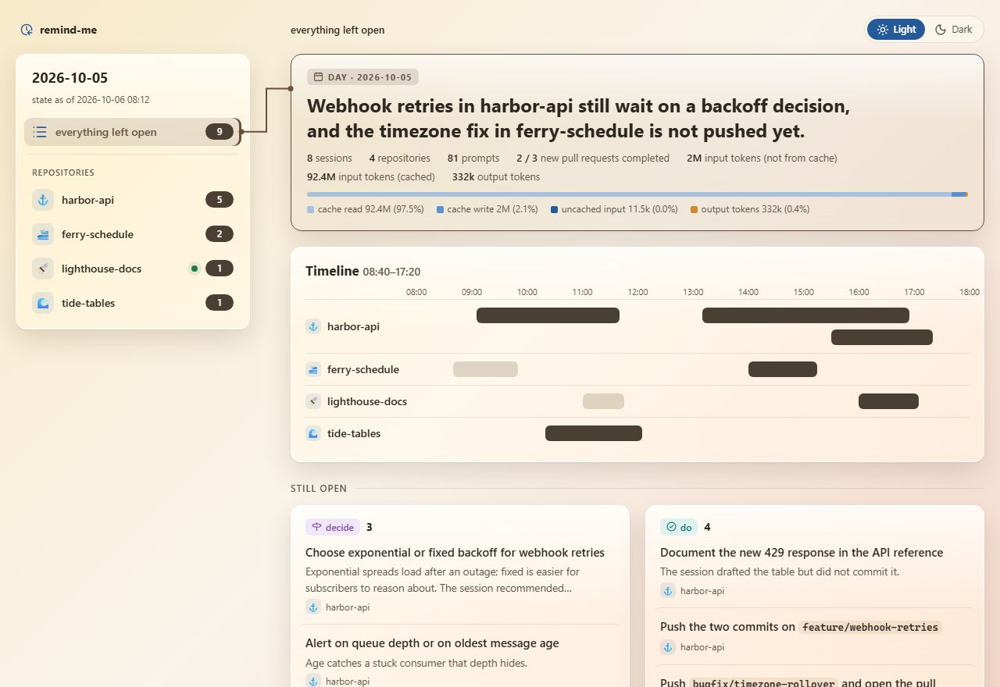
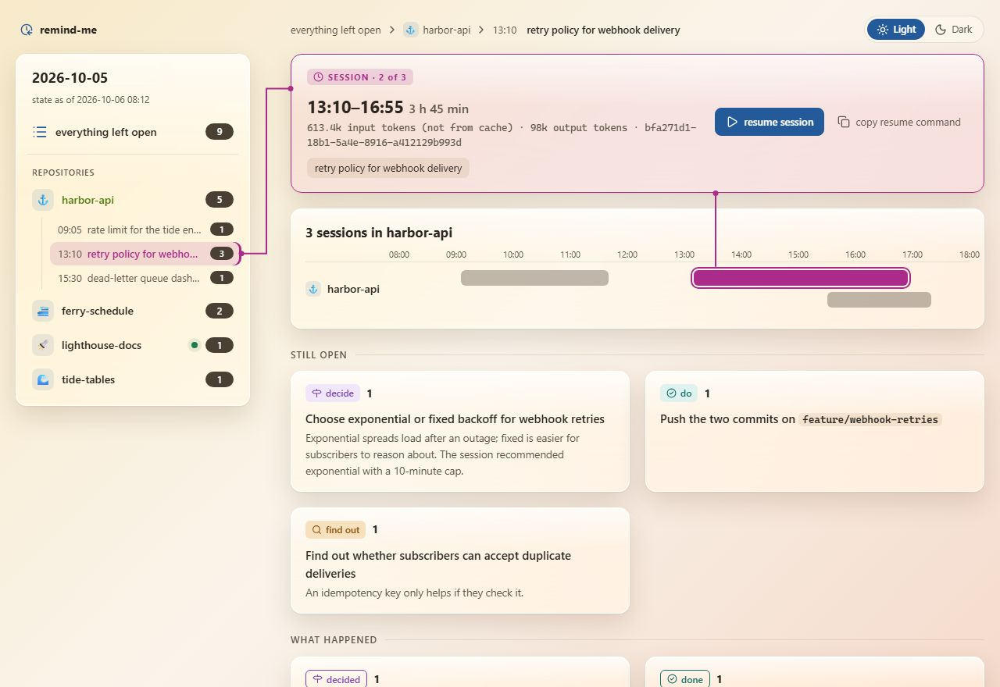
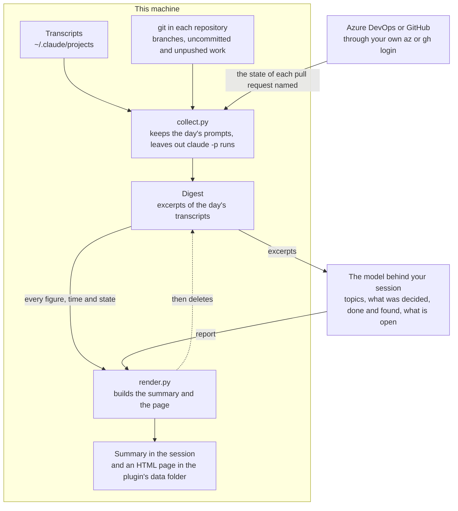

# remind-me

[English](README.md) | [繁體中文](README.zh-TW.md) | [简体中文](README.zh-CN.md)

What you left open in the Claude Code sessions you ran on a given day, grouped by repository and checked against the live state of the pull requests and branches they named, with a way back into each session in its own folder.

<picture>
  <source media="(prefers-color-scheme: dark)" srcset="docs/overview-dark.jpg">
  
</picture>

The screenshots on this page show a fictional day.

```
/plugin install remind-me@tundra
```

## Use

Ask in your own words, for example "what did I leave open yesterday?", or run `/remind-me:remind-me`, optionally with a day and a language: `/remind-me:remind-me last Friday, in German`. Without a day it reports the most recent day before today on which you typed a prompt in an interactive session, so on a Monday it reports Friday, and a day that holds only `claude -p` runs is skipped.

You get a summary in the session that lists what is still open, and an HTML page that opens in your browser: the day's figures across all repositories, including token usage, a timeline of every session by repository, and everything left open.

Select a repository or a session in the side panel or on the timeline for its topics, what it left open, what it decided, did and found out, and the buttons that take you back into it in its own folder. A session that is still running is marked, and cannot be resumed from the page, since that would open it twice.

<picture>
  <source media="(prefers-color-scheme: dark)" srcset="docs/session-dark.jpg">
  
</picture>

The page is the day as it was, judged from that day's prompts alone, while pull requests and branches show their state as of now, because a pull request a session left in review is often merged the same afternoon.

## What it reads and what it sends



It reads the transcripts Claude Code keeps on this machine under `~/.claude/projects`, for every repository you worked in that day. It runs `git` in each of those repositories, and `az` or `gh` to look up the pull requests the sessions named. Without `az` or `gh`, or without a login, a pull request's state is reported as not checked, never as pending.

The model in your session reads the digest, so excerpts of that day's transcripts reach the model, the same way a file does when you ask Claude to read it. The lookups ask Azure DevOps or GitHub, through your own CLI login, for the state of each pull request named and for the account you are signed in as, which tells your new pull requests from your colleagues'. Nothing else leaves the machine, and the page loads nothing from the network.

The report and the page are written to the plugin's own data folder, `~/.claude/plugins/data/remind-me-tundra/reports/`, and the digest is deleted once the report is rendered. The report records the work rather than the data the work touched, so credentials, people's names, customer and account identifiers, and anything read from a production system are left out.

Claude Code deletes transcripts older than `cleanupPeriodDays`, 30 days by default, so a day older than that cannot be reported; set it higher in `~/.claude/settings.json` to look further back.

## Requirements

Python 3.9 or later and `git`. The Azure CLI with the `azure-devops` extension, or the GitHub CLI, for pull request states.
