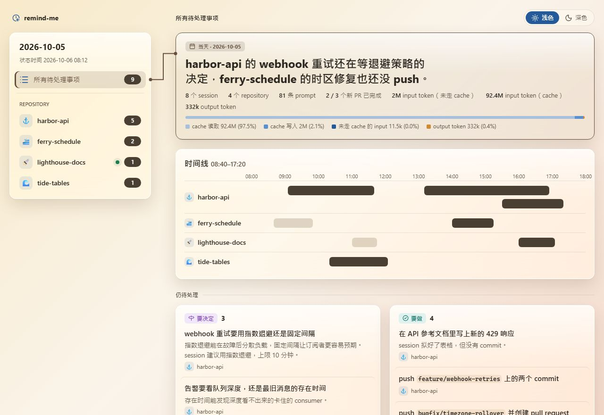
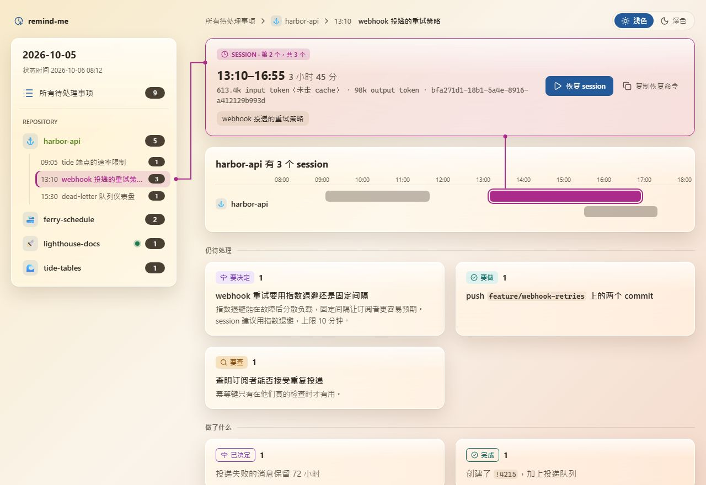
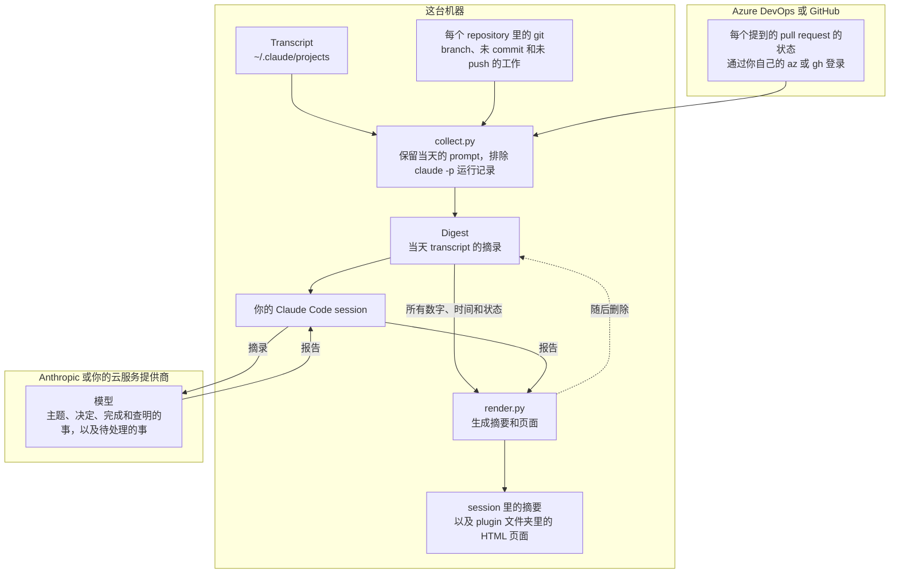

<!-- translated from README.md, source sha256 460476c48ef976d864ce530969d13225744574e732a52dc0ded90cf7fc52d822; see the root CLAUDE.md "Translations of a plugin's README" before editing -->
# remind-me

[English](README.md) | [繁體中文](README.zh-TW.md) | [简体中文](README.zh-CN.md)

你在某一天运行过的 Claude Code session 还留下哪些没做完的事，按 repository 分组，逐一对照它们提到的 pull request 和 branch 的实时状态，并提供回到每个 session 自己文件夹的入口。

<picture>
  <source media="(prefers-color-scheme: dark)" srcset="docs/overview-dark.zh-CN.jpg">
  
</picture>

本页的截图是虚构的一天。

## 安装

```
/plugin marketplace add https://github.com/softwareone-platform/tundra.git
/plugin install remind-me@tundra
```

安装后运行 `/reload-plugins` 启用它。

## 使用方法

用自己的话问，例如“我昨天留下了什么没做完？”，或运行 `/remind-me:remind-me`，可以加上日期和语言：`/remind-me:remind-me last Friday, in German`。没有指定日期时，它会报告今天之前、最近一个你在交互式 session 里输入过 prompt 的日子，所以周一运行会报告周五，只有 `claude -p` 运行记录的日子会被跳过。

你会在 session 里得到一份列出仍待处理事项的摘要，以及一个在浏览器中打开的 HTML 页面：所有 repository 当天的数字（包括 token 用量）、按 repository 排列的每个 session 时间线，以及所有还没做完的事。

在侧边栏或时间线上选择一个 repository 或 session，就能看到它的主题、留下的待处理事项、它决定了什么、做了什么、查明了什么，以及带你回到它自己文件夹的按钮。仍在运行的 session 会被标记出来，而且不能从页面恢复，因为那样会把它打开两次。

<picture>
  <source media="(prefers-color-scheme: dark)" srcset="docs/session-dark.zh-CN.jpg">
  
</picture>

页面呈现的是那一天当时的样子，只根据当天的 prompt 判断；pull request 和 branch 则显示现在的状态，因为 session 留在审查中的 pull request，常常当天下午就合并了。

## 它读取什么、发送什么



它读取 Claude Code 保存在这台机器 `~/.claude/projects` 下的 transcript，覆盖你当天工作过的每个 repository。它会在这些 repository 里运行 `git`，并用 `az` 或 `gh` 查询 session 提到的 pull request。没有 `az` 或 `gh`，或者没有登录时，pull request 的状态会标记为未查询，绝不会当成待审。

你的 session 里的模型会读取 digest，所以当天 transcript 的摘录会发送到模型那一端，就像你让 Claude 读取一个文件一样。查询会通过你自己的 CLI 登录，向 Azure DevOps 或 GitHub 询问每个提到的 pull request 的状态，以及你登录的账号，以此区分哪些新的 pull request 是你创建的、哪些是同事创建的。除此之外没有任何内容离开这台机器，页面也不会从网络加载任何内容。

报告和页面写在 plugin 自己的文件夹 `~/.claude/plugins/data/remind-me-tundra/reports/`，digest 在报告生成后就会删除。报告记录的是工作本身，而不是工作接触过的数据，所以凭据、人名、客户和账号的标识符，以及从 production 系统读取到的任何内容都不会写进去。

Claude Code 会删除超过 `cleanupPeriodDays`（默认 30 天）的 transcript，所以更早的日子无法报告；如果想往前看更久，可以在 `~/.claude/settings.json` 中把它调高。

## 要求

Python 3.9 或更高版本，以及 `git`。查询 pull request 状态需要安装了 `azure-devops` 扩展的 Azure CLI，或 GitHub CLI。
