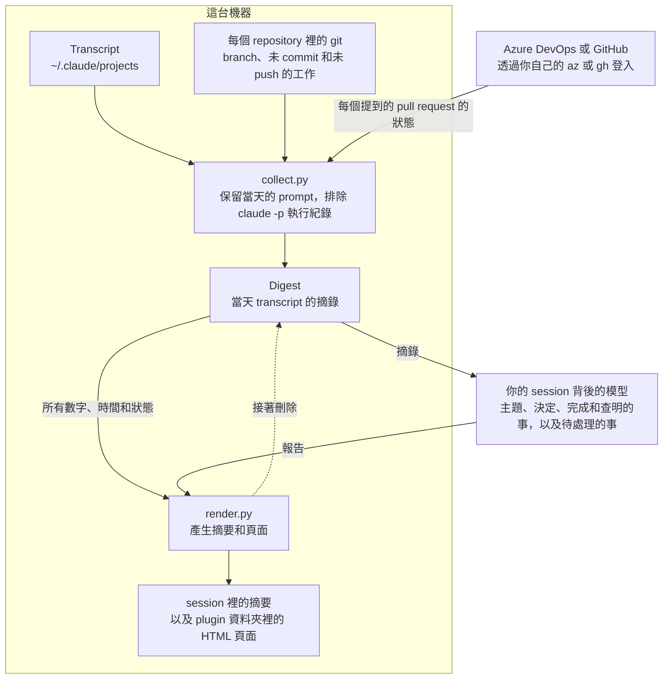

<!-- translated from README.md, source sha256 99e5b6dfb8556e8d924309672866e6d06b3d2e5e5bc4eef40d8c5d8edc0ed114; see the root CLAUDE.md "Translations of a plugin's README" before editing -->
# remind-me

[English](README.md) | [繁體中文](README.zh-TW.md) | [简体中文](README.zh-CN.md)

你在某一天跑過的 Claude Code session 還留下哪些沒做完的事，依 repository 分組，逐一對照它們提到的 pull request 和 branch 的即時狀態，並提供回到每個 session 自己資料夾的入口。

<picture>
  <source media="(prefers-color-scheme: dark)" srcset="docs/overview-dark.jpg">
  
</picture>

這一頁的截圖是虛構的一天。

```
/plugin install remind-me@tundra
```

## 使用方式

用自己的話問，例如「我昨天留下了什麼沒做完？」，或執行 `/remind-me:remind-me`，可以加上日期和語言：`/remind-me:remind-me last Friday, in German`。沒指定日期時，它會報告今天以前、最近一個你在互動 session 裡打過 prompt 的日子，所以週一執行會報告週五，只有 `claude -p` 執行紀錄的日子會被跳過。

你會在 session 裡得到一份列出仍待處理事項的摘要，以及一個在瀏覽器打開的 HTML 頁面：所有 repository 當天的數字（包括 token 用量）、依 repository 排列的每個 session 時間軸，以及所有還沒做完的事。

在側欄或時間軸上選一個 repository 或 session，就能看到它的主題、留下的待處理事項、它決定了什麼、做了什麼、查明了什麼，以及帶你回到它自己資料夾的按鈕。仍在執行的 session 會被標示出來，而且不能從頁面接續，因為那樣會把它開兩次。

<picture>
  <source media="(prefers-color-scheme: dark)" srcset="docs/session-dark.jpg">
  
</picture>

頁面呈現的是那一天當時的樣子，只根據當天的 prompt 判斷；pull request 和 branch 則顯示現在的狀態，因為 session 留在審查中的 pull request，常常當天下午就合併了。

## 它讀什麼、送出什麼



它讀取 Claude Code 存在這台機器 `~/.claude/projects` 底下的 transcript，涵蓋你當天工作過的每個 repository。它會在這些 repository 裡執行 `git`，並用 `az` 或 `gh` 查詢 session 提到的 pull request。沒有 `az` 或 `gh`，或沒有登入時，pull request 的狀態會標示為未查詢，絕不會當成待審。

你的 session 裡的模型會讀 digest，所以當天 transcript 的摘錄會送到模型那端，就跟你請 Claude 讀一個檔案一樣。查詢會透過你自己的 CLI 登入，向 Azure DevOps 或 GitHub 詢問每個提到的 pull request 的狀態，以及你登入的帳號，藉此分辨哪些新的 pull request 是你開的、哪些是同事開的。除此之外沒有任何東西離開這台機器，頁面也不會從網路載入任何東西。

報告和頁面寫在 plugin 自己的資料夾 `~/.claude/plugins/data/remind-me-tundra/reports/`，digest 在報告產生後就會刪除。報告記錄的是工作本身，而不是工作碰過的資料，所以憑證、人名、客戶和帳號的識別碼，以及從 production 系統讀到的任何內容都不會寫進去。

Claude Code 會刪除超過 `cleanupPeriodDays`（預設 30 天）的 transcript，所以更早的日子無法報告；要往前看更久，可以在 `~/.claude/settings.json` 把它調高。

## 需求

Python 3.9 以上和 `git`。查詢 pull request 狀態需要裝了 `azure-devops` 擴充功能的 Azure CLI，或 GitHub CLI。
