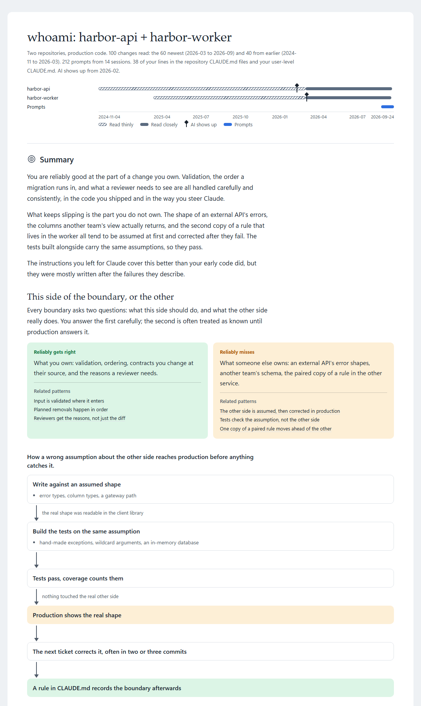
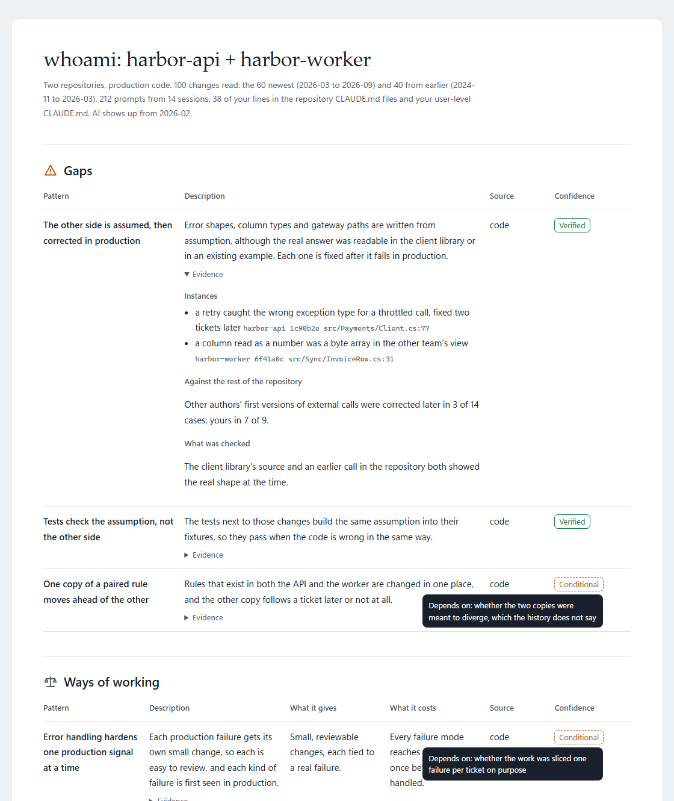

# whoami

A self-assessment built from what you produced: the code that shipped under your name, whether you typed it or directed a model to, the prompts you gave Claude, and the instructions you left it in `CLAUDE.md`. It finds the patterns that recur, tests each one against what could explain it away, and concludes what they say about how you work: the kind of question you reliably get right, and the kind you reliably miss. Every pattern in the report comes with the commits, prompts, or rules it came from, and a strength comes with the places you did not do it. It gives no type, score, or rating.

<picture>
  <source media="(prefers-color-scheme: dark)" srcset="docs/report-overview-dark.png">
  
</picture>

The screenshots on this page show a report on two fictional repositories.

## Use

```
/plugin install whoami@tundra
```

```
/whoami:whoami                                                  the repository this session is in
/whoami:whoami ~/source/repos                                   every repository directly under that directory
/whoami:whoami ~/source/repos/orders                            one repository
/whoami:whoami ~/source/repos/orders ~/source/repos/accounts    several repositories, separated by spaces
```

It asks you only what the material cannot show, before it reads anything: which repositories and sources to include, and which commit identities are yours. It does not ask when you started using AI. Code a model wrote under your direction still shipped under your name, so it reads all of it, and it finds the date AI shows up in each repository from the history itself. That date lets it tell a pattern of yours from a habit of the tool: a pattern seen before and after it is yours, and one seen only after it counts as yours only when your prompts or instructions show you asked for it.

It reads the code with several subagents in parallel, so a report over a few dozen commits does not keep you waiting on one reader.

It does not ask you to confirm its findings. For each pattern it looks for the constraint that would explain it away, such as a package that other repositories consume, a gate CI enforces, or a standing instruction the prompt relied on, and checks it in the material. When the constraint lies outside anything it can read, the report states the pattern as holding unless that constraint does.

It assesses the person running it. The material it reads and the context it asks for belong to the person who did the work, so pointing it at someone else's commits produces guesses.

## What it reads and what it sends

**Code** is read through git only: the history, the diffs of your commits, and the code around them at each commit. It never reads your working tree, so untracked and ignored files such as local settings and secrets stay out of the analysis.

**Prompts** are read from the Claude Code transcripts on this machine, under `~/.claude/projects`, and only from sessions whose working directory was inside the repositories you chose. Only the text you typed is taken. Model output, tool output, skill content, summaries, and messages from other sessions are all left out, as are the copies a resumed session keeps of earlier prompts, and pasted content is replaced by its size. The transcripts go back as far as Claude Code's `cleanupPeriodDays` setting keeps them, 30 days by default. The transcript format is not documented. If it changes, whoami says so rather than reporting that you gave no prompts.

**Instructions** are each repository's `CLAUDE.md` and `.claude/rules/`, read through git, with only the lines you wrote taken from a shared file, and your user-level `~/.claude/CLAUDE.md` and `~/.claude/rules/`.

What it reads goes to the model, the same way a file does when you ask Claude to read it. Your prompts reached the model once already, when you typed them. Give it only the repositories you would open in Claude anyway. The scope is only what you pass it, and with no argument it is the repository you are in.

It writes only the report, and never into your repositories. The report goes to `~/.claude/plugins/data/whoami-tundra/reports/` as a JSON document and a self-contained HTML file that loads nothing from the network. The session shows a summary with the HTML file's path, and that summary is the last thing whoami writes. The report holds your repository names and short quotes of your prompts, so delete it when you no longer need it.

The report opens with a timeline of what it read: the span of each repository's changes, with the newest read closely and the older ones sampled more thinly, where AI shows up in each, and the days your prompts cover. The conclusion rests on that material and no more, so the timeline comes first. Then comes the conclusion: the kind of question you reliably get right, and the kind you reliably miss. Then it lists your strengths, your gaps, and your ways of working, meaning trade-offs that are neither. Each pattern says how sure the analysis is: verified, or conditional on a constraint it could not check, which the report names. Then comes what the patterns mean for your work, and what the analysis was based on. The evidence for each pattern, and the candidates the analysis refuted, are in the HTML, collapsed.

<picture>
  <source media="(prefers-color-scheme: dark)" srcset="docs/report-tables-dark.png">
  
</picture>

## Requirements

[Python](https://www.python.org/downloads/) on `PATH`, for reading prompts and rendering the report. It uses the standard library only and is tested on 3.13.

## Status

This is an experiment. If the people who try it find that its conclusions tell them nothing they did not already know, this plugin will be withdrawn.
