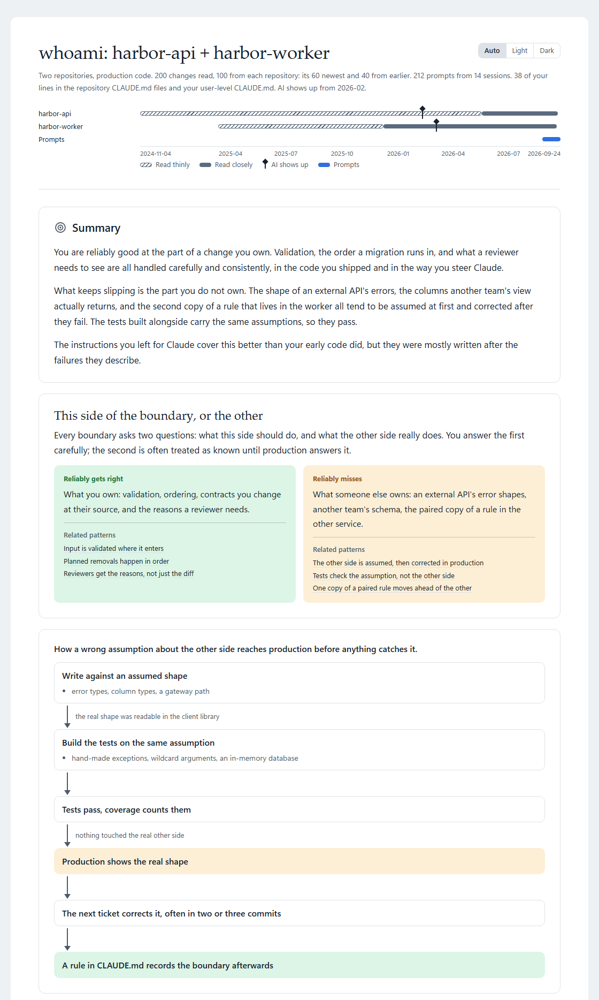
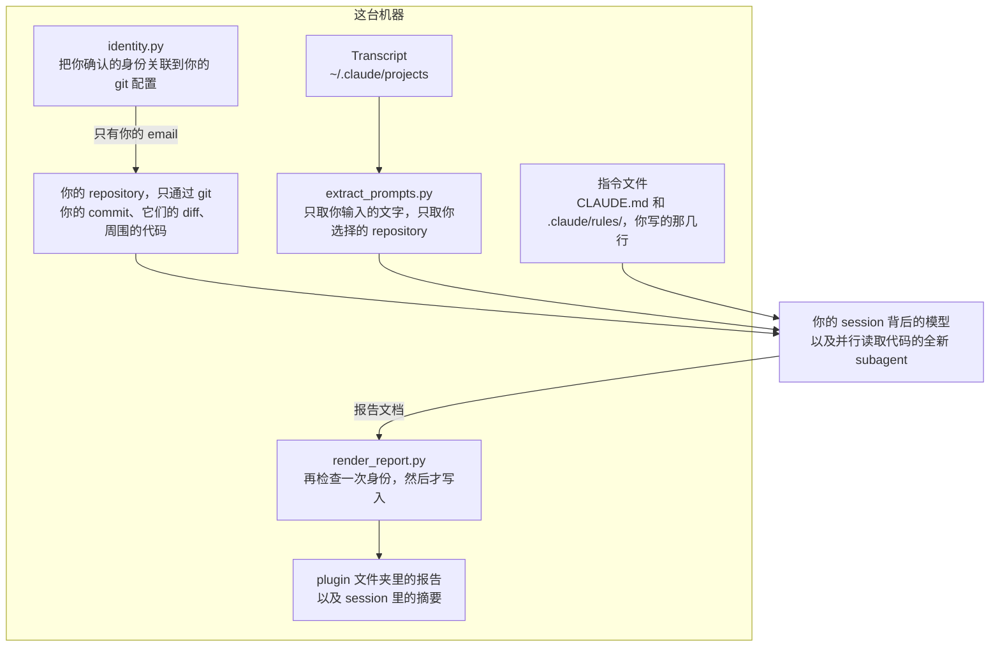
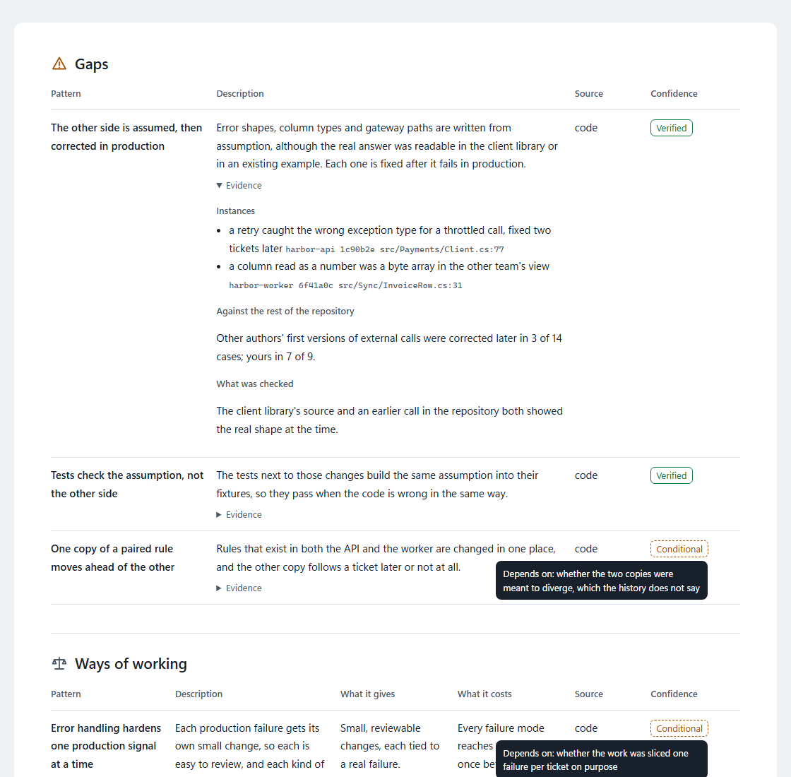

<!-- translated from README.md, source sha256 68be0eacf2d2a1f9b6ff0f59572a5c07c13191e8bbd645b51768a3ab5d9146cb; see the root CLAUDE.md "Translations of a plugin's README" before editing -->
# whoami

[English](README.md) | [繁體中文](README.zh-TW.md) | [简体中文](README.zh-CN.md)

一份根据你产出的东西做出的自我评估：以你的名义交付的代码（不论是你亲手写的，还是你指挥模型写的）、你给 Claude 的 prompt，以及你在 `CLAUDE.md` 里留给它的指令。它找出反复出现的模式，逐一检验每个模式有没有其他原因能解释，再总结出这些模式说明了你怎样工作：哪一类问题你稳定做对，哪一类问题你稳定漏掉。报告里的每个模式都附上它出自哪些 commit、prompt 或规则。强项还会列出例外，也就是你没有做到它所称赞那件事的那些变更，所以没有一个强项会读起来比你的实际表现更一致。它不给类型、分数或评级。

<picture>
  <source media="(prefers-color-scheme: dark)" srcset="docs/report-overview-dark.png">
  
</picture>

本页的截图是一份针对两个虚构 repository 的报告。

## 使用方法

```
/plugin marketplace add https://github.com/softwareone-platform/tundra.git
/plugin install whoami@tundra
```

安装后运行 `/reload-plugins` 启用它。

```
/whoami:whoami                                                      the repository this session is in
/whoami:whoami ~/source/repos                                       every repository directly under that directory
/whoami:whoami ~/source/repos/orders and ~/source/repos/accounts    two repositories
/whoami:whoami ~/source/repos/orders, in German                     one repository, with the report in German
```

用自己的话说明要读哪些 repository、报告用哪种语言写。相对路径从你所在的目录读起。它在读取任何东西之前，会先说明它理解到了什么，所以误解只会多花你一次回答。没有指定语言时，它会使用你一直和 Claude 交流的那种语言。报告很长，所以请指定你读起来最轻松的语言。

它在每个 repository 中最多读取你的 100 个变更：最新的 60 个仔细读，另外 40 个分散在更早的所有变更里，所以报告反映的是你现在怎样工作，也仍然能看到你以前怎样工作。每多一个包含你变更的 repository，就会多花一些时间和 token；不包含你任何变更的 repository 会很快被跳过。

它只问材料本身看不出来的事，而且在读取任何东西之前就问：要包含哪些 repository 和来源，以及哪些 commit 身份是你的。它不会问你什么时候开始使用 AI。你指挥模型写的代码仍然是以你的名义交付的，所以它全部都读，并从历史本身找出每个 repository 中 AI 出现的日期。这个日期让它能区分你的模式和工具的习惯：在这个日期前后都能看到的模式是你的。只在日期之后出现的盲点仍然算你的，因为是你让它通过的；但强项只有在你的 prompt 或指令显示你提出过要求时，才算你的。

它用多个 subagent 并行读取代码，所以读几十个 commit 的报告不会让你一直等待同一个读者。

它不会请你确认它的发现。对每个模式，它会寻找能解释掉这个模式的约束条件，例如被其他 repository 使用的包、CI 强制执行的关卡，或 prompt 所依赖的长期指令，并在材料中核实。当约束条件不在它能读到的范围内时，报告会把这个模式写成“除非那个约束条件成立，否则成立”。

它评估的是运行它的人。它读取的材料和它询问的背景都属于做这些工作的人，所以用它去读别人的 commit 只会得到猜测。它从你 repository 中配置的 git 身份开始，当你确认的身份和那个身份没有关联时，它会停下来，不写报告。

## 它读取什么、发送什么



**代码**只通过 git 读取：历史、你的 commit 的 diff，以及每个 commit 当时周围的代码。它绝不从你的 working tree 读取代码，所以未跟踪和被忽略的文件，例如本地配置和密钥，都不会进入分析。它从 working tree 读取的文件只有下面列出的指令文件。

**Prompt** 从这台机器上的 Claude Code transcript 读取，位置在 `~/.claude/projects`，而且只读取工作目录在你选择的 repository 中的 session。只取你输入的文字。模型输出、工具输出、skill 内容、摘要和其他 session 发来的消息全部排除，恢复的 session 保留的旧 prompt 副本也排除，粘贴的内容则替换为它的大小。transcript 能往前追溯多久，取决于 Claude Code 的 `cleanupPeriodDays` 设置保留多久，默认 30 天。transcript 的格式没有公开文档。如果格式变了，whoami 会直接说明，而不是报告你没有给过任何 prompt。

**指令**包括：每个 repository 通过 git 读取到的 `CLAUDE.md` 和 `.claude/rules/`，共享文件中只取你写的那几行；git 没有跟踪的指令文件，例如被 gitignore 的 `CLAUDE.md` 或 `CLAUDE.local.md`，从你的工作副本按文件名读取，旁边的其他文件一概不读；以及你用户级别的 `~/.claude/CLAUDE.md` 和 `~/.claude/rules/`。

它读取到的内容会发送给模型，就像你让 Claude 读取一个文件一样。你的 prompt 在你输入的时候，就已经发送给模型一次了。只把你本来就会在 Claude 中打开的 repository 交给它。范围只限于你传给它的内容，不带参数时就是你所在的 repository。

它只写报告，而且绝不写入你的 repository。报告会写到 `~/.claude/plugins/data/whoami-tundra/reports/`，包括一份 JSON 文档和一个不从网络加载任何内容的独立 HTML 文件。session 会显示一份附带 HTML 文件路径的摘要，而那份摘要是 whoami 写的最后一样东西。报告中有你的 repository 名称和你 prompt 的简短引文，所以不再需要时就把它删除。

报告开头是它读取了什么的时间线，一直到报告当天：每个 repository 哪些地方每个变更都读了、哪些较旧的地方是抽样的、哪些地方什么都没读，接着是 AI 在每个 repository 中出现的位置，以及你的 prompt 覆盖的日子。结论只建立在这些材料之上，所以时间线放在最前面。接着是结论：哪一类问题你稳定做对，哪一类问题你稳定漏掉。然后列出你的强项、你的盲点，以及你的工作方式，也就是既不算强项也不算盲点的取舍。每个模式都会说明分析有多确定：已验证，或是取决于一个它无法核实的约束条件，报告会写明是哪一个。接着是这些模式对你的工作意味着什么，以及分析依据了哪些材料。每个模式的证据，以及分析推翻的候选模式，都在 HTML 中，默认折叠。HTML 会按照你系统的浅色或深色设置显示，角落的切换可以覆盖它。

<picture>
  <source media="(prefers-color-scheme: dark)" srcset="docs/report-tables-dark.png">
  
</picture>

## 要求

`PATH` 上需要有 [Python](https://www.python.org/downloads/)，用于读取 prompt 和生成报告。它只使用标准库，并在 3.13 上测试过。
