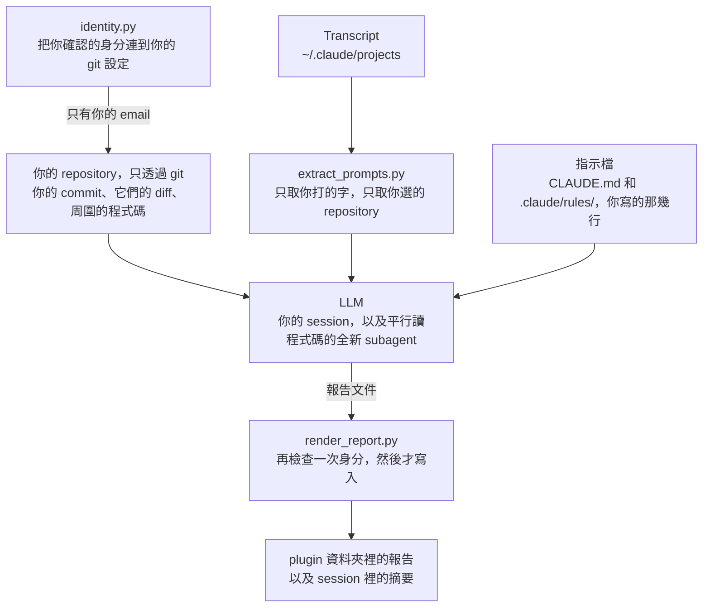
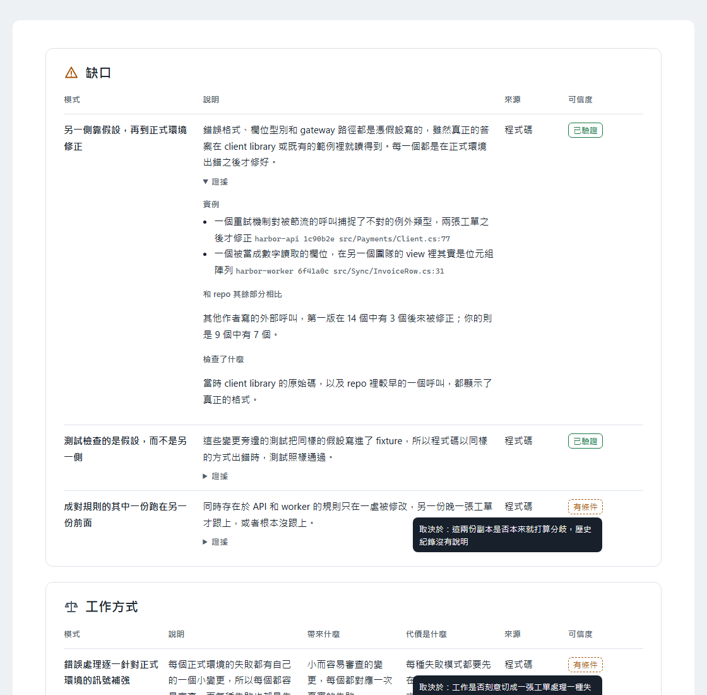

<!-- translated from README.md, source sha256 7ec3f3ec18df5d8cf6d5d55f97b7f0b3736b8364970fca2dfd3b618f9a4d6981; see the root CLAUDE.md "Translations of a plugin's README" before editing -->
# whoami

[English](README.md) | [繁體中文](README.zh-TW.md) | [简体中文](README.zh-CN.md)

一份從你產出的東西做出的自我評估：以你的名義交付的程式碼（不論是你親手寫的，還是你指揮模型寫的）、你給 Claude 的 prompt，以及你在 `CLAUDE.md` 留給它的指示。它找出反覆出現的模式，逐一檢驗每個模式是否有其他原因能解釋，再歸結出這些模式說明了你怎麼工作：哪一類問題你穩定做對，哪一類問題你穩定漏掉。報告裡的每個模式都附上它出自哪些 commit、prompt 或規則。強項還會列出例外，也就是你沒做到它所稱讚那件事的那些變更，所以沒有一個強項會讀起來比你的實際表現更一致。它不給類型、分數或評等。

<picture>
  <source media="(prefers-color-scheme: dark)" srcset="docs/report-overview-dark.zh-TW.png">
  
</picture>

這一頁的截圖是一份針對兩個虛構 repository 的報告。

## 使用方式

```
/plugin marketplace add https://github.com/softwareone-platform/tundra.git
/plugin install whoami@tundra
```

安裝後執行 `/reload-plugins` 啟用它。

```
/whoami:whoami                                                      the repository this session is in
/whoami:whoami ~/source/repos                                       every repository directly under that directory
/whoami:whoami ~/source/repos/orders and ~/source/repos/accounts    two repositories
/whoami:whoami ~/source/repos/orders, in German                     one repository, with the report in German
```

用自己的話說要讀哪些 repository、報告用哪種語言寫。相對路徑從你所在的目錄讀起。它在讀任何東西之前，會先說明它理解到什麼，所以誤解只會多花你一次回答。沒指定語言時，它會用你一直和 Claude 溝通的那種語言。報告很長，所以請指定你讀起來最輕鬆的語言。

它在每個 repository 最多讀你的 100 個變更：最新的 60 個細讀，另外 40 個分散在更早的所有變更裡，所以報告反映的是你現在怎麼工作，也還看得到你以前怎麼工作。每多一個有你變更的 repository，就多花一些時間和 token；沒有你任何變更的 repository 會很快被跳過。

它只問材料本身看不出來的事，而且在讀任何東西之前就問：要包含哪些 repository 和來源，以及哪些 commit 身分是你的。它不會問你什麼時候開始用 AI。你指揮模型寫的程式碼仍然是以你的名義交付的，所以它全部都讀，並從歷史本身找出每個 repository 裡 AI 出現的日期。這個日期讓它能分辨你的模式和工具的習慣：在這個日期前後都看得到的模式是你的。只在日期之後出現的缺口仍然算你的，因為是你讓它通過的；但強項只有在你的 prompt 或指示顯示你要求過時，才算你的。

它用好幾個 subagent 平行讀程式碼，所以讀幾十個 commit 的報告不會讓你一直等同一個讀者。

它不會請你確認它的發現。對每個模式，它會找能解釋掉這個模式的限制條件，例如有其他 repository 使用的套件、CI 強制執行的關卡，或 prompt 所倚賴的長期指示，並在材料裡查證。當限制條件不在它讀得到的範圍裡，報告會把這個模式寫成「除非那個限制條件成立，否則成立」。

它評估的是執行它的人。它讀的材料和它詢問的背景都屬於做這些工作的人，所以拿它去讀別人的 commit 只會得到猜測。它從你 repository 裡設定的 git 身分開始，當你確認的身分和那個身分沒有關聯時，它會停下來，不寫報告。

## 它讀什麼、送出什麼



**程式碼**只透過 git 讀取：歷史、你的 commit 的 diff，以及每個 commit 當時周圍的程式碼。它絕不從你的 working tree 讀程式碼，所以未追蹤和被忽略的檔案，例如本機設定和祕密，都不會進入分析。它從 working tree 讀的檔案只有下面列出的指示檔。

**Prompt** 從這台機器上的 Claude Code transcript 讀取，位置在 `~/.claude/projects`，而且只讀工作目錄在你選的 repository 裡的 session。只取你打的字。模型輸出、工具輸出、skill 內容、摘要和其他 session 傳來的訊息全部排除，接續的 session 保留的舊 prompt 副本也排除，貼上的內容則換成它的大小。transcript 能往前追溯多久，取決於 Claude Code 的 `cleanupPeriodDays` 設定保留多久，預設 30 天。transcript 的格式沒有公開文件。如果格式改了，whoami 會直接說明，而不是報告你沒有給過任何 prompt。

**指示**包括：每個 repository 透過 git 讀到的 `CLAUDE.md` 和 `.claude/rules/`，共用檔案裡只取你寫的那幾行；git 沒有追蹤的指示檔，例如被 gitignore 的 `CLAUDE.md` 或 `CLAUDE.local.md`，從你的工作副本依檔名讀取，旁邊的其他檔案一概不讀；以及你使用者層級的 `~/.claude/CLAUDE.md` 和 `~/.claude/rules/`。

它讀到的東西會送到模型，就跟你請 Claude 讀一個檔案一樣。你的 prompt 在你打出來的時候，就已經送到模型一次了。只給它你本來就會在 Claude 裡打開的 repository。範圍只限你傳給它的東西，不帶參數時就是你所在的 repository。

它只寫報告，而且絕不寫進你的 repository。報告會寫到 `~/.claude/plugins/data/whoami-tundra/reports/`，包括一份 JSON 文件和一個不從網路載入任何東西的獨立 HTML 檔。session 會顯示一份附上 HTML 檔路徑的摘要，而那份摘要是 whoami 寫的最後一樣東西。報告裡有你的 repository 名稱和你 prompt 的簡短引文，所以不需要時就把它刪掉。

報告開頭是它讀了什麼的時間軸，一直到報告當天：每個 repository 哪些地方每個變更都讀了、哪些較舊的地方是抽樣的、哪些地方什麼都沒讀，接著是 AI 在每個 repository 出現的位置，以及你的 prompt 涵蓋的日子。結論只建立在這些材料上，所以時間軸放在最前面。接著是結論：哪一類問題你穩定做對，哪一類問題你穩定漏掉。然後列出你的強項、你的缺口，以及你的工作方式，也就是既不算強項也不算缺口的取捨。每個模式都會說明分析有多確定：已驗證，或是取決於一個它無法查證的限制條件，報告會寫出是哪一個。接著是這些模式對你的工作代表什麼，以及分析根據了哪些材料。每個模式的證據，以及分析推翻的候選模式，都在 HTML 裡，預設收合。HTML 會依你系統的淺色或深色設定顯示，角落的切換可以改掉它。

<picture>
  <source media="(prefers-color-scheme: dark)" srcset="docs/report-tables-dark.zh-TW.png">
  
</picture>

## 需求

`PATH` 上要有 [Python](https://www.python.org/downloads/)，用來讀取 prompt 和產生報告。它只用標準函式庫，並在 3.13 上測試過。
